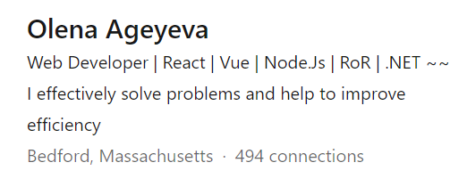
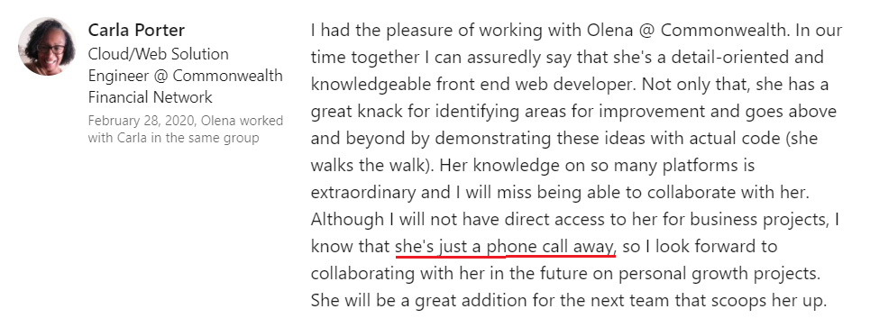
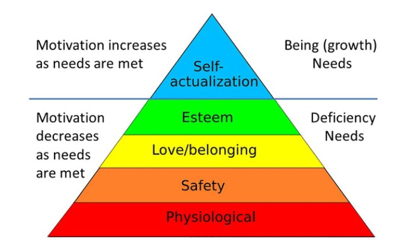

This is my first post on my new blog! How exciting!
### Vacation...
I am currently on vacation, enjoying plenty of free time to rethink my day-to-day life concepts and approaches and put my reflections into words.

What I’ve discovered is that, at my age and stage—combining all my work and life experience—I am still surprisingly shy when it comes to expressing myself. I wish I had as much freedom as the person in the quote below.

> Correspondents who tried emailing The Toast editor and Texts From Jane Eyre author Mallory
> Ortberg in July received an email with the subject line “nope.”
>
> “I am currently on vacation and not accepting any emails about anything. I’m not planning
> on reading any old emails when I get back, either, because that feels antithetical to the
> vacation experience.”
>
> “I really did delete all those emails when I got back,” Ms. Ortberg said.
>
> [Source](https://www.nytimes.com/2015/08/28/fashion/the-art-of-the-out-of-office-reply.html?smid=fb-nytimes&smtyp=cur&fbclid=IwAR2ZuvWs-dyyj6XRGRzxqaEZKxe9008fOJ_Nd36tTu8ZoERorHjC0aCYRyU)

### Freedom or not...
ut on second thought, do I really want that level of freedom? Once, while doing some job search preparation, I was asked to outline my mission to use as my LinkedIn profile headline. The one I chose may not be the most compelling headline, but it describes me pretty accurately.



### Self-brand...
During my time at Commonwealth Financial Network, I signed up for a "Building Your Brand" training. In the first session, we were asked to think of one word to describe how we’d like others to see us. Most people said "professional," which makes a lot of sense—but for some reason, it didn’t resonate with me. I don’t need others to see me as a professional; that's already an internal standard. Instead, I want people to see me as approachable—the person people come to with all sorts of problems and questions, and who gets things done no matter what.
That’s why I love the recommendation my former colleague Carla left on my LinkedIn profile so much. It shows that my ultimate goal of being seen as approachable is recognized by others.



### Self-actualization...
To summarize, being there for others is one of my primary growth needs—perhaps even the only one that doesn’t stem from a lack of something, but rather from a desire to grow as a person. According to Maslow’s hierarchy, once these growth needs are reasonably satisfied, one may reach the highest level, called self-actualization. From my own experience, I can say that being "just a phone call away" for my teammates and friends drives me, fuels my motivation to expand my expertise in various areas, and simply makes me happy.


### Done so far...
Some of the recent community projects I started or participated in:

1. Code for Boston - Participated in multiple projects as a React/Front-End Developer.
2. Russian Club for Book Lovers - My free community project started in December 2016. The club meets monthly since than and has over 50 active participants.
3. Mathwell - A community program for elementary school children interested in STEM. Together with a team of STEM professionals (actuaries, university faculty, teachers, tech managers), we developed a scalable model to teach children STEM in a real-world context, nurturing a true passion (or even addiction) for learning.
4. GWP - Growing Well Preschool -  A bilingual, constructivist-inspired program run in collaboration with local art/language studios, including Draw to Grow, Znaika, Sally's Dance, Yoga with Danny, and more.
5. GWP Family Program - A community program for families with children aged 0-5, offering music and movement activities in both Russian and English.

### Say "Hello!"
```js
function helloWorld() {
  alert("Hello, World!")
}
```

import Button from "src/components/button"

<Button onClick={()=>alert("Hello, World!")}>Test</Button>


