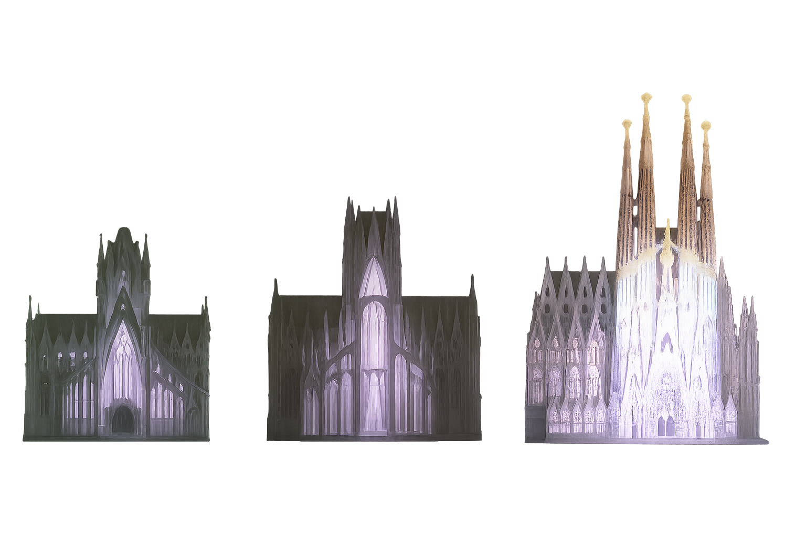

I recently visited **La Sagrada Família** in Barcelona and was deeply moved by something beyond its stunning architecture.

In an immersive video experience, I watched how one of Gaudí’s now-iconic arches evolved. The original design? Already good — tall, geometric, and functional. But someone (likely Gaudí himself) said:

*"It’s not enough."*

He probably brought that thought to a group — and I imagine the reaction:

*“Why change what works?”*

*“You’re overthinking it.”*

Maybe even laughter.

But he didn’t give up. He redesigned it. Doubled the light. Pushed the height. Infused nature’s patterns into geometry. It became not just beautiful, but groundbreaking.

And still, he said: *“It can be better.”*

More laughter. More resistance.

But he did it anyway.

He created a global landmark — *not by settling for good, but by insisting on better.*

It resonated because… I’ve been that person.

The one in the meeting who says: *"We can do better."*

The one who hears:

*“That’s not how we do it.”*

*“We’ve always done it this way.”*

So I sigh.

And I do it.

I build it better, alone if I have to. I present it. Inspire others. And the team rises with it.

Over and over.

As a leader, you’ll never hear me laugh at a bold idea.

*I welcome it. I nurture it. I help bring it to life.*

Even the wild ones — especially the wild ones.

Because “we’ve always done it this way” is the most dangerous phrase in innovation.

Life *is* change.

Evolution happens through revolutions.

And revolutions begin with someone brave enough to imagine something better.

You can choose to be part of that revolution — or stand in its way.

I know where I stand.

> Once, a colleague said about the transformations I led:
> **“**We don’t always agree—but most likely, she’s right.**”**
>
> It took me a year of hard work to earn that kind of trust.
> Yes, we disagreed—a lot.
> But time and again, I proved that the “wild,” the “unimaginable,” the “beyond believable” ideas…
> *actually worked.*
> And more than that—they made life better, simpler, and more joyful for everyone.