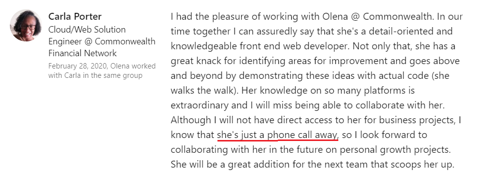

This is my first post on my new blog! How exciting!

### Vacation...
I am currently on vacation enjoying plenty of free time for rethinking my day-to-day life concepts and approaches and putting my reflection into words.

What I discovered that at my age and stage with all work and life experience and expertise combined I am still very shy when it comes to myself. I wish I had as much freedom as the person in the quote below.

> Correspondents who tried emailing The Toast editor and Texts From Jane Eyre author Mallory
> Ortberg in July received an email with the subject line “nope.”
>
> “I am currently on vacation and not accepting any emails about anything. I’m not planning
> on reading any old emails when I get back, either, because that feels antithetical to the
> vacation experience.”
>
> “I really did delete all those emails when I got back,” Ms. Ortberg said.
>
> [Source](https://www.nytimes.com/2015/08/28/fashion/the-art-of-the-out-of-office-reply.html?smid=fb-nytimes&smtyp=cur&fbclid=IwAR2ZuvWs-dyyj6XRGRzxqaEZKxe9008fOJ_Nd36tTu8ZoERorHjC0aCYRyU)

### Freedom or not...
But on the second thought do I really? Once, while doing some sort of job search preparation, I was tasked with outlining my mission to put it in my LinkedIn profile headline. The one I chose is, ultimately, not the best possible headline, but one which describes me pretty accurately.


### Self-brand...
In my time at Commonwealth Financial Network, I signed up for a "Building Your Brand" training. During the first session people in the room were asked to think of one word that describes how they would like others to see them like. Most of people said "as professionals", which probably makes a tons of sense, but for some reason did not resonate with me much. I do not want others to see me as a professional - that's the internal ethic out of question. Instead, I'd like people to see me as "approachable". The one who people come to with all sorts of problems and questions and who gets them all taken care of at all cost. That's why I love the recommendation my former colleague Carla left on my LinkedIn profile so much. It indicates that my ultimate goal to be "approachable" as a brand is being seen by others.



### Self-actualization...
To summarize all said being here for others is one of or maybe even the only my growth need that do not stem from a lack of something, but rather from a desire to grow as a person. According to the theory once such growth needs have been reasonably satisfied, one may be able to reach the highest level called self-actualization. From my own experience I can say that being "just a phone call away" for my teammates and friends is something that drives me in life, increases my motivation to expand in-depth expertise in different scopes and areas, and simply makes me happy.


### Done so far...
Some of the recent community projects I started or participated in:

1. Code for Boston - I participated in multiple project as a React/Front-End Developer
2. Russian Club for Book Lovers - My free community project started in December 2016. The club meets monthly since than and has over 50 active participants.
3. Mathwell - My community program for elementary school children that have extensive interest in STEM. Together with a collaborative team of STEM field professionals (actuaries, university faculties, teachers, technology managers) we developed a light scalable alternative model to teach children STEM and math within a real world context and nurture a true love and even addiction (in a sense of intense irresistible desire) to learning.
4. GWP - Growing Well Preschool - A bilingual in-depth program based on constructivist theme-inspired model of education run in collaboration with multiple local studios, including Draw to Grow, Znaika, Sally's Dance, Yoga with Danny, and more.
5. GWP Family Program - A community program for families with children 0-5 offered music and movement activities in Russian and English.

### Say "Hello!"
```js
function helloWorld() {
  alert("Hello, World!")
}
```

import Button from "src/components/button"

<button onClick={()=>alert("Hello, World!")}>Test</button>


