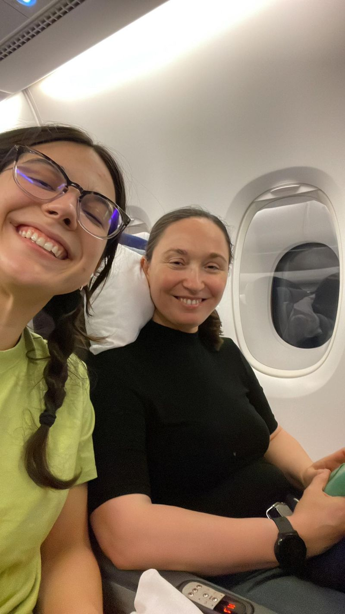

**Off we go! 🛫** Flying over the seas to celebrate my daughter [Mariya Pominova](https://www.linkedin.com/in/mariyapominova/)'s admission to the Duke University PhD in Economics program and my completion of the EMBA with the [Quantic School of Business and Technology](https://quantic.edu). 🎓 Exciting times ahead!

I'm thrilled to be part of the Quantic community, where diversity, inclusion, and revolutionary innovation in education delivery are making a real impact on a global scale. Throughout my educational journey—spanning multiple programs, four degrees, and countless certification courses—I have never experienced anything quite like Quantic. The combination of mind-blowing fun and engaging learning methods for subjects like math, accounting, finance, and economics brought a wide smile to my face throughout the process.

What truly sets Quantic apart is the incredible diversity within my cohort. People from all corners of the world, speaking different languages and working at prestigious companies across the globe, have come together. It's inspiring to see a significant number of students running their own innovative businesses. I hold immense respect for these individuals. When you're already successful, why pursue further education? It's not for prestige or promotions—it's about going deeper, connecting more dots, and elevating their work to new academic heights.

As I head to Barcelona for my graduation, the final ceremony of a remarkable 2.5-day global conference organized by Quantic, I feel immense pride in the journey we've all undertaken. Thank you, Quantic, for providing a transformative educational experience that combines academic excellence with a joyful approach to learning—shaping a future where knowledge knows no boundaries.

