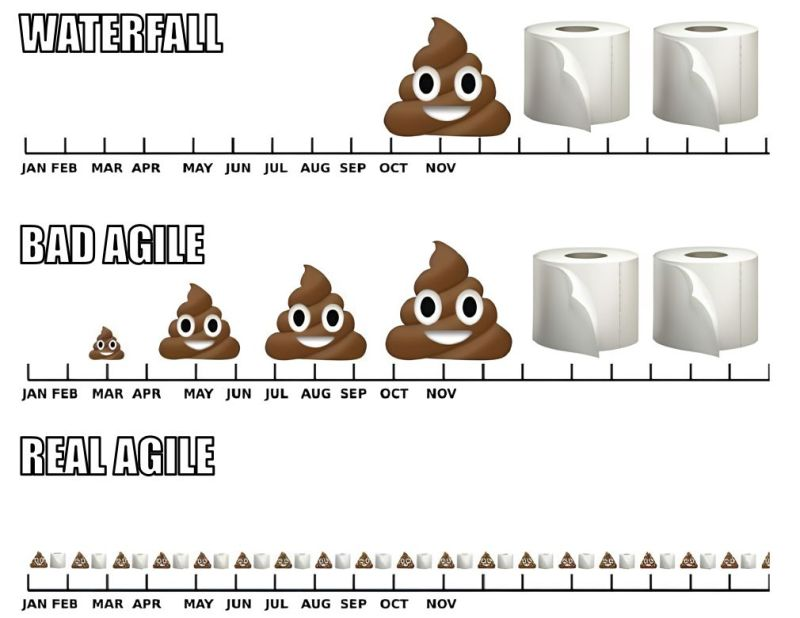

Ever wonder why you can walk into a supermarket for "just milk" and leave with $82 of snacks and three types of cheese you don’t even like?

Or why Netflix just *starts* the next episode without asking you?

Or why social media apps are designed to scroll forever, with no natural stopping point?

Spoiler: **It’s not you. It’s the system.**

Behind every decision you make—every swipe, click, and “sure, why not”—there’s often a hidden force:

> **A Nudge.**

- - -

## What Is a Nudge?

A **nudge** is a subtle design choice that influences your behavior without restricting your freedom.

Coined by behavioral economists Richard Thaler and Cass Sunstein in the book *Nudge*, the idea is simple:

> *Change the environment, and you change behavior.*

It’s not about controlling people.\
It’s about structuring choices to make certain behaviors *more likely*.

This is called **choice architecture**—and it’s literally everywhere.\
\
Watch it in action. That beautifully illustrates these real-world nudges in action.

<iframe width="560" height="315" src="https://www.youtube.com/embed/LF4ETgw29BA?si=DCLgWljDtFMsDz7F" title="YouTube video player" frameborder="0" allow="accelerometer; autoplay; clipboard-write; encrypted-media; gyroscope; picture-in-picture; web-share" referrerpolicy="strict-origin-when-cross-origin" allowfullscreen></iframe>

From how kids choose snacks to how drivers slow down on curves, these examples show the power of *gentle correction over hard control*. A must-watch if you want to spot nudges in the wild.

## Nudges Are Everywhere (For Better or Worse)

Here's the thing: nudges aren’t always good.\
They can lead to growth—or doomscrolling.

* 🛒 **Supermarkets** put essentials in the back so you pass the snacks.
* 📺 **Netflix** autoplays episodes to remove the pause moment.
* 📱 **Social apps** use infinite scroll to keep you hooked.
* 🏢 **Office snack counters** place donuts at eye level and fruit in the basement fridge.

These are not evil. They’re just… strategic. They’re **designed to steer your behavior**. 

Sometimes for your good.\
Sometimes... not so much.

But if you’re not aware, you’ll find your day (or career) shaped by someone else’s design.

## 🧠 **Agile — done well —** Is a S**elf-Reinforcing** Nudge System

Here’s the fun part: **Agile—done well—is a self-reinforcing nudge system.**

Now let’s bring it back to your world—tech teams, product delivery, code, and chaos.

Agile, at its core, is **not just a project management framework**. It’s a **behavioral design system**—a set of nudges that help teams:

* Focus
* Collaborate
* Deliver value early
* Course-correct frequently

It nudges teams toward transparency, small wins, course correction, and sustainable pace. Not by forcing it—but by designing it.

Here’s how Agile applies nudge thinking:

| Desired Behavior                         | Agile Nudge                           |
| ---------------------------------------- | ------------------------------------- |
| Deliver small increments                 | Sprint planning, story sizing, DoD    |
| Reflect and improve                      | Retrospectives and team health checks |
| Limit distractions and context-switching | WIP limits, sprint commitment         |
| Align teams on goals                     | Backlog refinement, visible boards    |
| Focus on value                           | Iterative delivery + demos            |
| Build trust and autonomy                 | Empowered teams, self-organization    |
| Encourage ownership                      | Daily standups, team planning         |
| Reduce analysis paralysis                | ⏱️ Time-boxing (sprints, ceremonies)  |

Agile doesn’t force teams to be “better” or “be smarter.” It designs systems where *smart choices* are easier. It **nudges** them to *work in ways that naturally lead to better outcomes.*

> The goal isn't to rely on discipline. It's to remove friction from the behaviors that actually lead to progress.

When teams struggle with Agile, it’s often because they’re **missing these nudges**. Instead, they’re cargo-culting ceremonies without adjusting the actual environment.

## 🎯 Outcome: Teams That Learn and Ship

Done right, Agile removes decision fatigue and replaces it with structured momentum.

* Instead of debating for days, you time-box.
* Instead of building for 6 months in isolation, you demo every 2 weeks.
* Instead of hoarding unfinished work, you finish small pieces early and often.

These are **intentional nudges** to make great software more likely—without requiring herculean effort every day.

## Nudge Yourself, Too

Let’s talk about my *self-investment* habit.

I’ve taken so many certifications, degrees, and Coursera courses that I may qualify as an honorary server farm at this point. I’m not saying this to brag—though my Google Drive is quietly panicking—but to highlight something important:

I didn’t *force* myself to learn.\
I designed my environment so that learning became the **default**—the easiest, most obvious choice.

* Books live next to my bed.
* Course bookmarks live on my browser homepage.
* Emails from “Learning Platforms” are filed under “Treat Yo’self.”

Basically, I’ve nudged myself into being a **knowledge sponge**. Whether I’m showing up as a leader, teammate, partner, or friend—there’s always something useful I can bring to the table.

If you want to stay relevant in tech (without burning out), you can nudge yourself too.\
Here’s the system I use:

* I attend **weekly meetups and workshops** (most are free and incredibly insightful).
* I actively network with engineers, tech leads, and founders to stay sharp and connected.
* I **set aside a personal budget** to attend 5+ conferences annually—no matter if my company foots the bill or not.

I don’t do this because I’m ultra-disciplined.\
I do it because I’ve made learning the *easiest path*—a **nudge-powered growth loop** that feeds curiosity and compounds value over time.

And hey, do you enjoy good food, quality entertainment, intelligent conversations, and a bit of travel?\
Maybe even Vegas?

**Guess what?** I treat myself to all of the above *every year*—by attending **AWS re:Invent**, one of the biggest tech conferences in the world, held in Las Vegas every November.\
One week of learning, connecting, geeking out over cloud innovation—and yes, maybe a little blackjack.

Nudging never felt so fun.

## 🧻 Final Thought

You don’t need to force better habits.

You just need better defaults.

Whether you’re building habits for yourself, or helping your team succeed—**design the path of least resistance to align with your values.** That’s the real power of nudging.

So go ahead. Move the fruit bowl to eye level.\
Put your high-value stories at the top of the backlog.\
Shrink your WIP. Block your focus time.

**You can’t always control people’s decisions. But you can control the menu.**