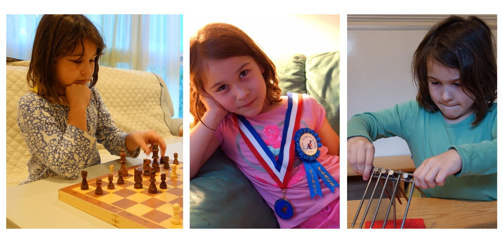

Once upon a time, I decided to take my 5-year-old daughter, Alex, to a highly reputable math studio for an introductory visit. The owner of the studio, armed with a solid math education and 20 years of experience running programs for K-12 students, graciously scheduled time for us. I was excited—what could possibly go wrong?

When we arrived, she pulled out a mosaic board, carefully built a simple pattern on one side, and then turned her attention to chatting with me. Meanwhile, Alex, curious as ever, decided to explore the mosaic herself. She built her own design on the other side of the board—a design that, unbeknownst to her, was being evaluated.

Here’s the kicker: the studio owner never gave Alex any instructions. No one told her to copy the example on the other side of the board. Alex simply did what 5-year-olds do—she created something entirely her own, much more intricate and sophisticated than the original.

After about 10 minutes, the studio owner delivered her grand conclusion: *“Your daughter is not ready for math classes yet.”* She explained—quite verbosely, I might add—how children need to master units, then tens, then hundreds before they can even *dream* of understanding math. To justify her verdict, she pointed to Alex’s mosaic design and concluded that, because Alex didn’t match the sample pattern, she must not grasp the concept of units and tens. My eyebrows raised higher with each sentence, like parabolas shooting off the graph. “Huh?” I asked a few clarifying questions, trying to make sense of her algorithm for evaluating math readiness.

At the end I smiled and thanked her for her time. *“Come back in a year,”* she said. I knew one thing for sure—we weren’t coming back.

Why? Because her evaluation system missed something glaringly obvious—like an elephant in the room holding a calculator. It was a spectacular demonstration of what happens when educators rely on rigid stereotypes and fail to recognize the potential of children who deviate from the "average." Instead of nurturing creativity and curiosity, the system squashed it with misplaced assumptions.

Let me explain. Just a few weeks earlier, Alex approached me holding her stuffed bunny and asked, *“The bunny is curious—can 2 + 2 = 5 ever be correct?”*

I know this may not sound like a typical 5-year-old question, but this was classic Alex. Her curiosity was boundless and her thinking refreshingly unconventional.  I replied, *“In some contexts, it can be. There are actually several ways that could make sense mathematically. Can you find them?”*

And guess what? She did! Alex came up with three solutions:

1. Numbers are symbols we humans agreed upon. If we create our own [math ring](https://en.wikipedia.org/wiki/Ring_(mathematics)) and redefine what “2,” “+,” and “5” mean, we could make 2 + 2 = 5 true.
2. Operations like “+” and “=” are conventions. If we reassigned their functions, anything is possible.
3. Finally, consider dynamics: during an [infinitesimally](https://en.wikipedia.org/wiki/Infinitesimal) small moment while performing the addition, the two “2’s” could grow by 0.5 each, resulting in a total of 5.

I was so impressed that I shared Alex’s ideas with [Bob and Ellen Kaplan](https://people.math.harvard.edu/~knill/various/bobkaplan/index.html), math professors at Harvard and founders of the Math Circle Alex attended. They validated her thinking as mathematically sound and praised her creativity.

For context, Alex and I had already explored [binary](https://en.wikipedia.org/wiki/Binary_number), [decimal](https://en.wikipedia.org/wiki/Decimal), and [*n*-number systems](https://en.wikipedia.org/wiki/Positional_notation). She quickly grasped that the decimal system is just one of many ways to think about numbers. 

And speaking of "traditional" conventional public school math... Two weeks later, [Math Kangaroo](https://mathkangaroo.org/mks/) results came in: Alex [ranked 1st ](https://mathkangaroo.org/mks/wp-content/uploads/2022/04/2017_Level-1_National-Winners.pdf)*nationwide* in her age category. A week after that, her IQ test results arrived—she scored above 130. Both the math olympiad and the cognitive test were conducted in English, which, at the time, was her second language with limited exposure.

The moral of the story? Rigid benchmarks often fall short when they encounter exceptions. True talent lies not in simply following formulas, but in thinking beyond them. After all, evolution wouldn’t happen without the courage to try things differently. And remember—if you’re going to evaluate someone’s math readiness, make sure to check for elephants—and maybe stuffed bunnies—before jumping to conclusions.

