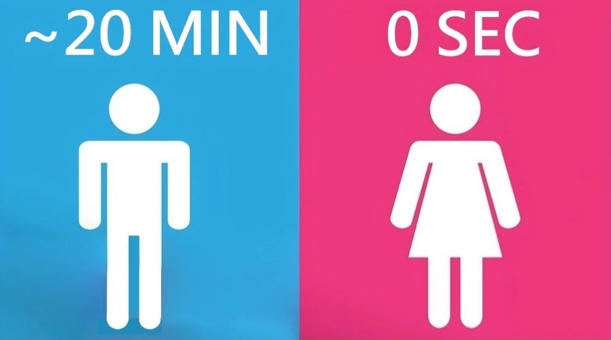

I love data—it’s my thing. I track numbers for almost everything, even my own custom daily score (yes, I compete with yesterday-me). Naturally, this habit doesn’t take a break during conferences.

AWS re:Invent is one of the world’s biggest tech events, and I always enjoy attending. The last-day re:Play party has become iconic, featuring world-class celebrity DJs, music groups, engaging games, an inclusive menu, and more.

While soaking in the festivities, I couldn’t help but make an observation. Turning to a colleague, I quipped, “Want to guess how many women attended re:Invent? 5%.”

Curious, they asked, “How did you figure that out?”

I gestured toward the *definitive proof*: two massive, snaking lines, hundreds deep, stretching toward the gentlemen’s restroom.

And the ladies’? An echoing void. Not a line, not a wait. Just blissful emptiness.

It’s like the restroom lines were delivering a live, unfiltered demographic report. 😏

While I’m 95% confident in my restroom-line methodology (pun intended), but wonder:

1️⃣ What’s the *real* data? Is attendee demographic information available?

2️⃣ How many others made the same observation and drew a similar conclusion?

3️⃣ What might be the flaws in my logic? (Because even data-driven humor deserves some statistical rigor, right?)

Let me know what you think! And to my fellow data enthusiasts: the next time you're at a conference, keep an eye on those restroom lines—they might just be the most unexpected dataset of the day. 😉