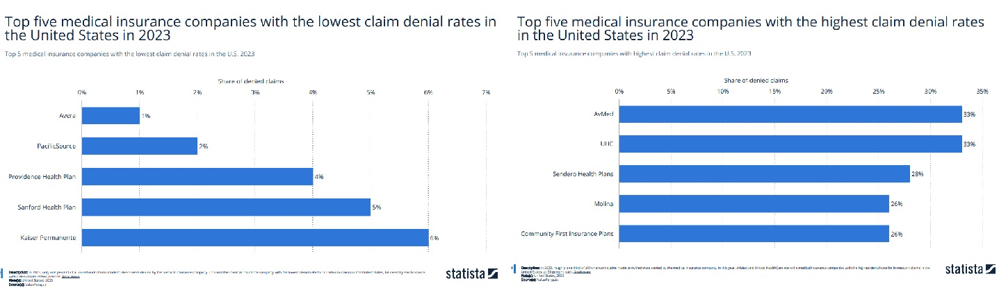
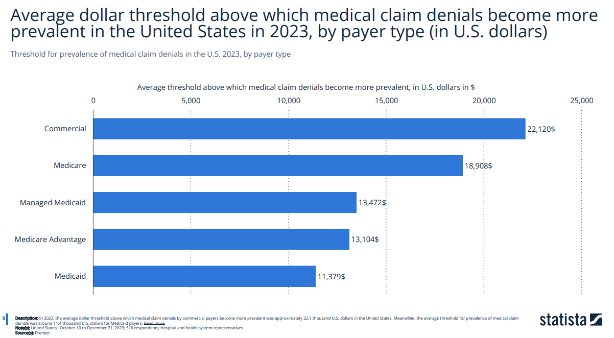
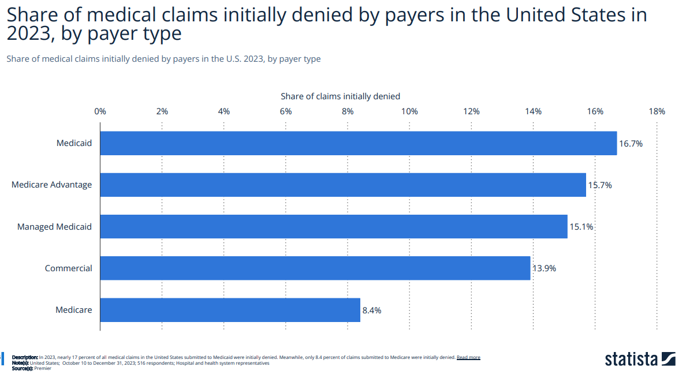
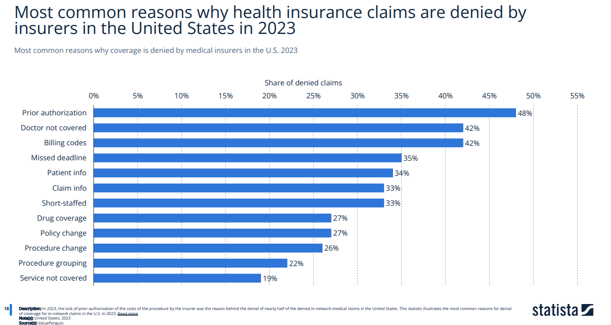

Imagine this: You’ve just been diagnosed with a serious condition. The treatment is urgent. Your doctor submits a request to your insurance provider. Days pass, and then the letter arrives—it’s a denial.

No coverage. No explanation that makes sense. Just a cold rejection.

Unfortunately, this is not a rare glitch in the system. It’s a feature.

### The Scale of the Problem

According to a comprehensive study by KFF ([link to source](https://www.kff.org)), health insurance claim denials in the U.S. marketplace are alarmingly common—and climbing.

📊 **Denial rates range from 1% to 33%**, depending on the insurer and state.\
*See Exhibit 3: Denial Rates by Issuer in the Federal Marketplace.*

And these aren't obscure claims. They include some of the most expensive, urgent, and potentially life-saving treatments.

And elderly people who need the access to medical treatment the most at this stage of life are the most impacted.

According to HealthCare.gov about 20% of all claims submitted in 2023 were denied. 60% of adults in US had any problems with their current health insurance in the past 12 month which resulted in treatment delays. 

### Why Are Claims Denied?

Insurers often cite **“other” or “lack of medical necessity”** as reasons for denial. But the definitions behind these terms are often vague and inconsistently applied. Lack of prior authorization remains the number one reason for claim denial and attributes to 10% or 7 million claim denials in 2023.

👀 *See Exhibit 5: Reasons for Denial*

\
In fact, in some plans, **over 80% of denied claims were for services doctors deemed medically necessary**.

### Patients Rarely Appeal—But When They Do, They Win

Perhaps the most staggering figure? **Less than 1 in 1,000 denials are appealed.**\
*See Exhibit 7: Rate of Appeals*

The process is difficult, opaque, and discouraging. Yet, **when patients do appeal, they win around 40% of the time**.

What does that tell us? The system is broken—not because patients lose, but because most never get a fair shot.

### The Human Cost

Behind every statistic is a real person. A father fighting cancer. A teenager needing emergency surgery. A parent trying to afford insulin.

Claim denial isn’t just administrative—it’s life-altering.

### It Doesn’t Have to Be This Way

We need:

✅ **Greater transparency** in denial reasoning.\
✅ **Simplified, automated appeals processes** supported by technology.\
✅ **Real-time claim prechecks** powered by AI to avoid denials before they happen.\
✅ **Better regulation and accountability** across plans and states.

- - -

### A Call to Action

As engineers, product designers, and leaders in health tech, we have a responsibility. The future of healthcare isn’t just about wearables and wellness apps—it’s about **building a system patients can trust**.

Let’s fix the frontlines.