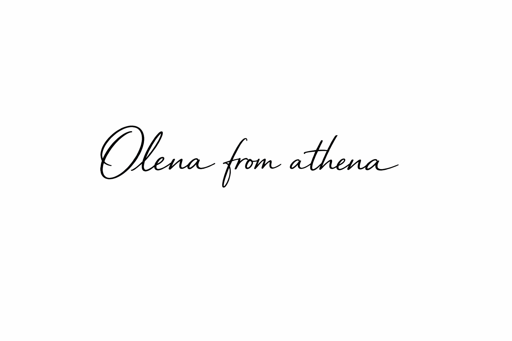

Has a stranger ever walked up to you and asked for a photo—like you’re a celebrity? It happened to me recently, and it left me with more than a smile. It left me thinking.

Let me tell you the story.

Not long ago, I received an email letting me know I’d been nominated as an honorary attendee at FutureCon, a local cybersecurity conference. The note was warm and thoughtful, complete with a complimentary full-access pass. My first reaction wasn’t excitement or pride—it was disbelief.

Cybersecurity has long been adjacent to my work, but it’s not part of my formal title. I don’t lead a security team. While I’ve been actively engaged with the WiCyS community—taking classes, volunteering as a mentor, attending events—I still didn’t see myself as someone who fit the mold of an “honorary attendee.”

But I showed up. Not out of confidence—out of curiosity. That, and I never turn down a free pass to a room full of smart people and sponsor swag.

And I’m so glad I did. FutureCon turned out to be one of the most meaningful professional experiences I’ve had. I was surrounded by brilliant minds—security leaders, researchers, engineers—all grappling with the complex, nuanced space where innovation meets protection, where automation meets trust, and where rapid progress demands responsible guardrails.

The sessions were deeply insightful. I learned how Active Directory can become a hidden bottleneck when responsibility is pushed entirely to end users. I heard lessons from real-world breaches and discussions on how the threat landscape continues to evolve. There were cautionary tales of AI gone wrong—and also inspiring stories about what becomes possible when we implement it responsibly.

One message in particular stayed with me. ShanShan Pa, VP of AI Governance at GlobalLogic, said: “We need technology and security to scale together—not one ahead of the other.” That perfectly captured the tension many of us face as leaders—driving innovation while staying grounded in accountability. It reinforced my belief that we all have a responsibility to build thoughtfully and securely, whether or not “security” appears in our job description.

Then came a surprise I wasn’t expecting. Toward the end of the event, I was called on stage to receive an award for impact in the cybersecurity space. I was genuinely taken aback. The host, Kim Hakim, did her best with my last name—always a fun adventure—and I walked up feeling honored, if still a little stunned.

A few minutes later, I was called again, this time as a raffle winner for visiting every sponsor booth. This time, Kim simply said, “Olena from athena.” It made me laugh—and honestly, it stuck. I’ve been called much worse in tech. And just like that, I had a new nickname.

On my way out—rushing a bit to get home in time for dinner—a gentleman stopped me at the door. He had a warm smile and said, “Are you Olena from athena?” I nodded, surprised.

“I’d love to take a photo with you,” he said. My confusion must have shown, because he quickly added, “My wife, Adebumni, talks about you all the time.”

Apparently, my reputation preceded me… just not in the way I expected.

Suddenly, it clicked. Adebumni and I had connected through WIT and WiCyS events. She’d participated in one of my workshops, and we’d collaborated virtually several times—but never met in person. And here I was, not even a full year into my journey at athena, being recognized by someone who knew me through her. That moment stayed with me.

Driving home, I found myself reflecting—not out of vanity, but clarity. It reminded me how easy it is to underestimate the ripple effect of what we contribute, especially when that contribution doesn’t come with a podium, a spotlight, or a formal title. Our reach often extends further than we realize. Sometimes, it takes a chance encounter—or a very attentive spouse—to remind us of that.

As if the week wasn’t energizing enough, the next day I attended the 39th Boston Code Camp at Microsoft and left with even more inspiration—from AWS’s AgentCore to Oracle’s insights into AI-driven claims processing. Every session, every conversation added something to the way I think and lead. I came back with a sharper perspective and stronger ideas to bring to my teams.

As leaders, we’re asked to make decisions all the time. The best ones aren’t gambles. They’re educated risks—grounded in experience, shaped by insight, and aligned with purpose. With every opportunity to learn from others—at conferences, in workshops, through conversations—I become more equipped to take those kinds of risks. The ones where the worst-case scenario is manageable, but the best-case outcome can be life-changing—transforming how we work, how we lead, and how we serve.

I didn’t think I deserved to be honored at a cybersecurity conference. But I listened. I learned. I showed up.

And I walked away with more than an award—\
I walked away better prepared to make an even greater impact.

Not because I had all the answers—\
But because I was willing to ask better questions.

If there’s one takeaway I’d love to leave you with, it’s this: every one of us can make a difference—by showing up, by staying curious, by asking thoughtful questions, and by bringing what we learn back to our teams, our work, and our lives.

There’s a wealth of resources available to all of us—WIT, Mentorship Programs,  WiCyS, and many more. These communities aren’t just opportunities to grow—they’re catalysts for raising the bar across our entire organization. Let’s keep learning, keep connecting, and keep leading together. Programs