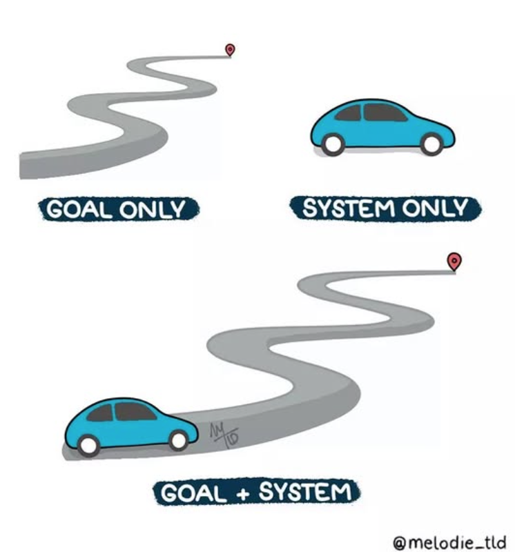

- - -

### Goals Fade. Systems Scale.

We’ve all set goals and lost steam. That’s because goals are moments—systems are momentum.\
As James Clear puts it in *Atomic Habits*:

> **“Winners and losers have the same goals.”**

The real edge? Identity-driven habits and systems that stick.

- - -

### Why Systems Matter

I once set a goal to become a regular runner. Bought the gear, followed influencers, made a plan… and quit three days later when ice cream went on sale.

Meanwhile, a friend just kept showing up. No hype—just habit. Her system won.

It’s no different in engineering. Everyone wants clean code, fast delivery, happy users. But the teams that actually get there? They’ve built systems—ATDD, CI/CD, clear DoD, fast feedback loops. Outcomes follow naturally.

> Think of the [*Broken Windows* theory from *The Pragmatic Programmer*](https://medium.com/logistimo-engineering-blog/programming-and-broken-windows-5a52bb1b3f0b)—leave one bad practice unchecked (a messy function, a skipped test), and soon the whole codebase starts to decay.\
> A good system guards against that. It catches broken windows early, before they become tech debt that trashes the neighborhood.

- - -

### Systems Are Who You Are

What changed everything for me was this: I stopped chasing outcomes and started building systems around who I wanted to be.

That’s why I’ve spent years investing in myself—certifications, degrees, leadership training. Not because I thought another credential would change my life, but because learning became part of my identity.

I’m not aiming to “succeed.” I operate as someone who values growth. That system shows up—in leadership, tech, and life.

It’s shaped how I lead, how I support my teams, and how I build systems that scale—whether I’m coding or coaching.

- - -

### Time Is the Great Multiplier

Time isn’t neutral—it’s compound interest in disguise.

* Feed it small, good habits? You build unstoppable momentum.
* Feed it shortcuts and excuses? It magnifies those too.

Tiny actions may feel like nothing—until they snowball into everything.

- - -

### A Few Quick Truths About Goals

**1. A goal is a moment. A system is a lifestyle.**\
Hit your goal? Great. But without sustainable habits, it doesn’t last.

**2. The journey matters more than the medal.**\
If you're miserable chasing a goal, you won’t be magically happy at the finish line. Make the process meaningful.

**3. Tiny steps beat big leaps.**\
Progress isn’t always pretty. Skip, stumble, groove—just keep moving with intention.

- - -

### What You Can Do Today

* Build systems worth sticking with
* Make the process joyful and sustainable
* Let time amplify your habits—not your excuses

Because goals set direction. But systems shape who you become.\
And the life (and codebase) you build is defined by what you do *every day*—not what you hope to achieve *someday*.

- - -

### Final Thought: Goals are direction. Systems are momentum.

Everyone wants to win. The real difference?\
Some people build the habits that make winning inevitable—again and again.

*(Inspired by Atomic Habits by James Clear and The Pragmatic Programmer by Andrew Hunt & David Thomas—both highly recommended.)*