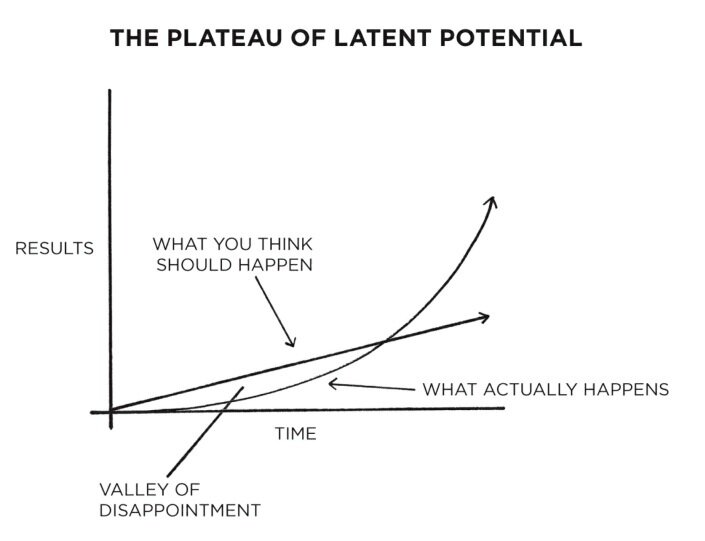

By now, you’ve probably realized life isn’t just a motivational poster in a yoga studio. You can have the perfect goal, the perfect planner, and the perfect Pinterest board—and still somehow end up eating ice cream straight out of the tub while binge-watching productivity videos.

It’s not just you. It’s *everyone*.

Because as James Clear boldly points out in *Atomic Habits*:

> ***“Winners and losers have the same goals.”***

Wait... excuse me? So *me* and Beyoncé both wanted to run the world, and only one of us ended up with a world tour?

## Goals Don’t Make You Special

Everyone wants to win.

No one says, “I really hope I underperform this quarter,” or “I’d love to be slightly worse than last year.” And yet, some people soar—and others stall.

Let’s take fitness as an example. (Classic.) A while back, I declared: *this is it*. This is the year I become one of those people who casually runs marathons, drinks smoothies with kale in them, and says things like “I just feel off when I skip leg day.”

I bought fancy yoga pants. Downloaded apps. Followed The Rock on Instagram. I was READY.

…For about three days.

Then I discovered that the local grocery store was having a 2-for-1 Ben & Jerry’s sale and decided that “bulking season” was probably a good start too.

Meanwhile, my friend Julia? She didn’t scream motivational quotes or post gym selfies. She just... kept showing up. Her goal wasn’t louder—her **system** was stronger.

## The Destination Isn’t the Journey

Here’s a truth bomb that’s both freeing and slightly rude:

**A goal is a destination. Not a path.**

A SMART goal might make your destination look shiny and clear. But without daily steps, it’s just a pretty dream.

You don’t magically land at your goal by staring at it harder. Trust me, I tried it with my houseplants. They’re still dead.

If you want to reach your goal, you need to consistently walk in that direction—preferably with shoes that don’t give you blisters by Day 2 and habits that don’t suck the life out of you halfway there.

## Time Is the Great Multiplier

Time is not neutral. It’s like compound interest with a sense of humor.

* Feed it good habits? Time becomes your loyal hype crew.
* Feed it bad habits? Time turns into that petty ex who brings up your worst moments at every dinner party.

Small actions today may feel like nothing, but give it a year? A decade? Time will exaggerate them.

Eating one donut won’t kill you. Eating one every day while saying “treat yo’self” like a mantra? Now you’re investing—in the opposite of your goal.

## Systems > Willpower

Let me get real for a second.

I’m a lifelong learner. No, like seriously—I probably have a million certifications, Coursera specializations, and degrees. I collect diplomas like other people collect souvenir mugs. Except I don't just hang them on the wall—I use them.

Investing in myself feeds my curiosity, shapes my values, expands my vision, and allows me to bring value *literally* anywhere—whether I’m wearing my IC hat, my leadership blazer, or my “mom has entered the chat” hoodie.

But here’s the twist: **I don’t do it for a goal.**

I don’t think, “I’ll be happy once I get this credential.” I do it because it’s *part of my system*. It’s what I do. Learning is my baseline. It’s how I connect, grow, and contribute—as a friend, partner, leader, or even the overly enthusiastic person in your book club who already read the sequel.

That’s the secret. I don’t chase outcomes. I invest in *identity-driven systems*.\
I’m not trying to “become successful.” I’m simply living as someone who values growth—and success is just one of the many outcomes that show up uninvited, like glitter after a craft party.

## A Few Eye-Opening Truths About Goals

Before you sprint toward your next shiny resolution, pause and reflect on these:

### 1. A Goal Is Just a Moment

Let’s say you finally run that marathon. Yay! You feel amazing. You wear the medal for a week straight. You post it on LinkedIn.

And then... you stop running. And suddenly, you and the medal are both retired.

Oops?

That’s why we don’t want goal-first thinking. Because if your habits only exist *for* the goal, they disappear *after* the goal. Instead, build systems that are worth doing **forever**, not just until someone hands you a medal and a banana.

### 2. If You’re Not Happy on the Way, You Won’t Be Happy at the Finish Line

This one’s counterintuitive, but 100% true. If your happiness is on pause until you “make it,” then what you’ve really done is set yourself up to be miserable *until further notice*.

Make your steps enjoyable. Dance while doing the work. Celebrate progress like your team just won the Super Bowl—even if you only wrote 100 words or drank one less soda.

### 3. Improvement Is a Journey of Daily Skips (With the Occasional Faceplant)

If you want a different outcome, you need different actions. But those actions don’t have to be grand.

They can be silly. Light. Joyful.

Improvement is a long walk with happy skips, occasional stumbles, and a soundtrack you love. And when you arrive at your goal? You wave, say, “Hey, nice to finally meet you,” then turn and stroll toward the next one—with a little more groove in your step.

- - -

## In Conclusion: Don’t Just Set Goals. Build Systems.

Because:

* Everyone wants to win.
* Not everyone builds the daily habits that turn “want” into “reality.”
* Time multiplies whatever you feed it.
* And joyfully showing up beats motivational burnout every single time.

So whether you’re learning, growing, skipping, stumbling, or snacking—do it with a system that brings meaning, energy, and a little bit of laughter.

Because winners and losers may have the same goals…

…but only winners build lives they actually *want* to live while getting there.

*This post was inspired by Atomic Habits by James Clear—a game-changing book about how tiny changes lead to remarkable results. You can grab a copy here: [Atomic Habits on Amazon](https://www.amazon.com/dp/0735211299)*