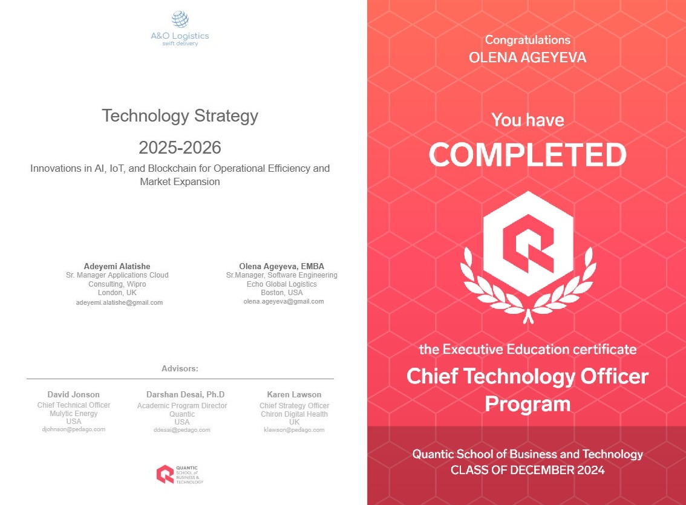

*Flashback to last September:*  
*"It’s my birthday, and I’m miserably sick,"* I thought as I logged into a 7am Zoom call with my capstone teammate, [**Adeyemi Alatishe**](https://www.linkedin.com/in/adeyemi-alatishe/).  
*"How’s the weather in London?"* I asked—only to hear he had joined an hour early and thought I ghosted him. Time zones, huh?  
We laughed, because what else can you do when the universe conspires against your calendar?

---

Why was I on a Zoom call for our regular capstone check-in—on my birthday—while feeling like a sneezy zombie?  
Because skipping never even crossed my mind.

[Quantic](https://quantic.edu/) has been a constant source of energy and inspiration—✨ like caffeine for my soul. Pausing? Not an option.

---

Now that I have my certificate in hand, I’m flashing back to that wild moment in September.  
Proud, honored, and maybe a little delirious to be part of the [Quantic](https://quantic.edu/) 
learning community.
[**Adeyemi Alatishe**](https://www.linkedin.com/in/adeyemi-alatishe/), thanks for sharing this learning journey with me!

**[Quantic School of Business and Technology](https://quantic.edu/)**
