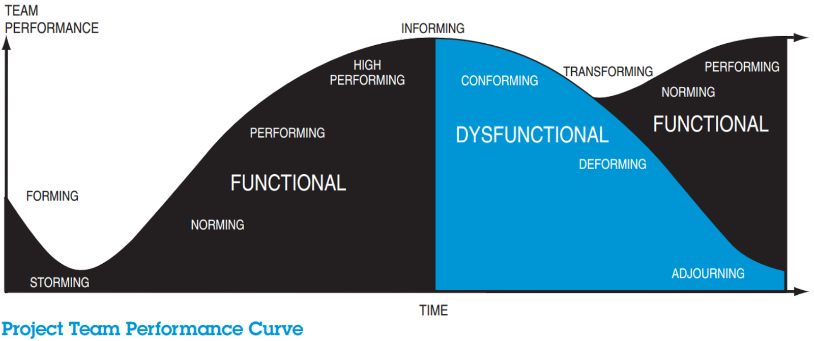
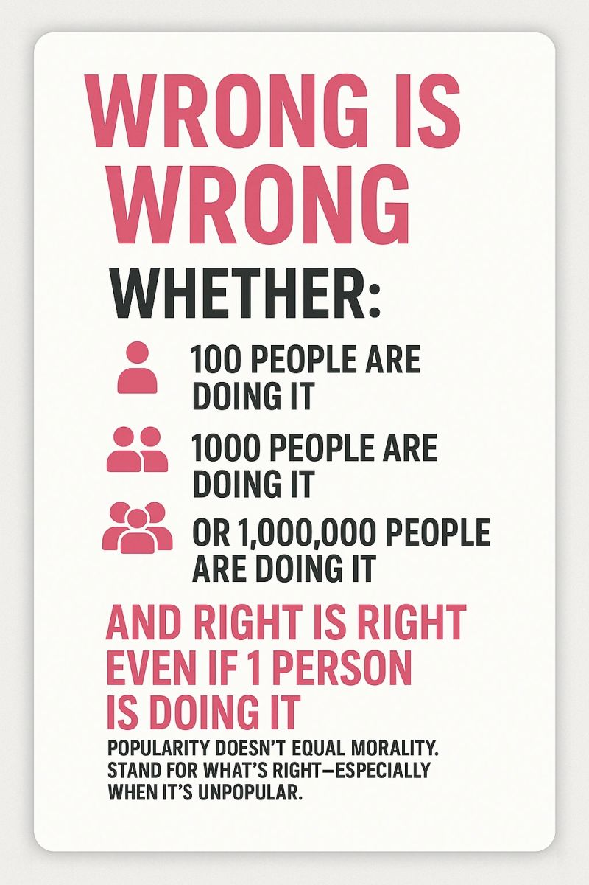

Have you ever sat through a meeting, nodding vigorously at John's half-baked idea simply because, "Hey, it's John, right? John's cool!" Or caught yourself squinting suspiciously at Mary’s (brilliant, it turns out) proposal, whispering silently, "Hmm... what’s her angle?"

Congratulations! You've officially entered what psychology lovingly calls the **"Conforming Stage."**

Oh yes, this is the cozy stage of team development, where harmony, trust, and group hugs reign supreme. Everything feels good here. It's comfortable. It’s predictable. But spoiler alert: it’s also the stage where great ideas often go to die quietly in the corner.

- - -

### Conformity: Nice for Picnics, Terrible for Innovation

In the eye-opening bestseller *Team of Teams*, General Stanley McChrystal reminds us that when teams place too much faith in familiar faces, innovation suffers—and sometimes, disastrously so. In Iraq, military intelligence once ran smoothly in tightly knit groups who trusted each other implicitly. That sounds great, right? Nope. It meant they systematically ignored great insights just because they came from unfamiliar faces—usually those annoyingly clever frontline soldiers who weren’t invited to the cool kids' meetings.

The uncomfortable truth? Even the smartest teams sometimes prefer the warm comfort of conformity over the cold shock of a new idea.

- - -

### "Conforming"—Now a Proven Business Killer!

Let’s take a stroll down Corporate Disaster Lane, shall we?

* **Kodak**: Famously stuck in conformity, Kodak’s leaders nodded at each other's belief that digital photography was just a fad. "Hey, why trust innovation when we can trust nostalgia?" Result: Bankruptcy selfies.
* **Blockbuster**: Leadership at Blockbuster stayed cozy, munching popcorn and reassuring each other that streaming was an overrated trend. “Trust us, people love driving in the rain to return DVDs at midnight!” Result: Netflix laughed last.
* **BlackBerry**: Remember them? Leadership confidently whispered, "People will never prefer typing on glass over buttons! Right, everyone?" Result: You’re probably reading this on your iPhone.

Do you see a theme emerging? Conformity kills—even if it’s politely and warmly executed over coffee and donuts.

- - -

### When Trust Gets Toxic (Oh, Hey, Katie!)

Let’s bring it home. Ever found yourself automatically agreeing with Katie's idea because she's charismatic, assertive, or just... persistent? Or maybe you've seen someone’s suggestion quietly discarded just because, "Well, he’s new, what does he know? 

Newsflash: Your comfort zone is sabotaging you. And let’s be clear: when the culture whispers “Trust Katie!” rather than “Trust good ideas!”, you might be heading into a corporate Game of Thrones. 

- - -

### How to Politely Kick Conformity Out the Door (Without Hurting Feelings—Too Much)

* **Normalize Idea-Based Critique**: Next time  Katie—or anyone—shares an idea, pretend you don't recognize who's speaking and just focus on the words. Weird trick, but it works.
* **Encourage Gentle Rebellion**: If everyone nods too quickly, raise your hand and say, "Just for fun, let's pretend  Katie’s idea came from someone we don't know. Would we still love it?" Cue awkward silence and breakthrough moments.
* **Celebrate (Healthy) Conflict**: Regularly reward the "rebels" who dare to disagree politely. And remember, the operative word is "politely"—let’s not start a riot, people.

- - -

### The Bottom Line (Because Engineers and Leaders Love Bullet Points):

* Trusting ideas purely because you trust the person = 🚩
* Ignoring ideas just because you don’t like the messenger = 🚩🚩
* If no one challenges ideas anymore, your team has entered the cozy but hazardous conforming stage. Danger level: Kodak/Blockbuster/BlackBerry.

- - -

## Still Not Convinced? Check Asch's Conformity Experiment

In Solomon Asch’s famous conformity experiment, **75% of participants** went along with obviously incorrect answers just because the group did. Only about **25% of participants consistently stood their ground**. Think about that: three-quarters of us might nod at a clearly bad idea simply because everyone else does.

<iframe width="560" height="315" src="https://www.youtube.com/embed/_IUlV5KI5B0?si=eoJqL5-bLpD702Um" title="YouTube video player" frameborder="0" allow="accelerometer; autoplay; clipboard-write; encrypted-media; gyroscope; picture-in-picture; web-share" referrerpolicy="strict-origin-when-cross-origin" allowfullscreen></iframe>

Personally, I'm proud to say I belong to that stubborn 25% who never conform—no matter how much I like John or how strongly the group pushes. I trust my gut, not the cozy consensus. And history suggests that's often the right call.

- - -

### TL;DR (Too Long, Didn't Rebel):

Feeling too comfortable around the conference table lately? It's probably time to shake things up. Embrace discomfort. Question your trust reflex. Otherwise, you might just become the next business school case study, and frankly, nobody wants to be in a PowerPoint slide titled: "When Comfort Killed Innovation."

So, hey, Katie—and everyone else—let’s start politely disagreeing. Your business’s future might just depend on it.

