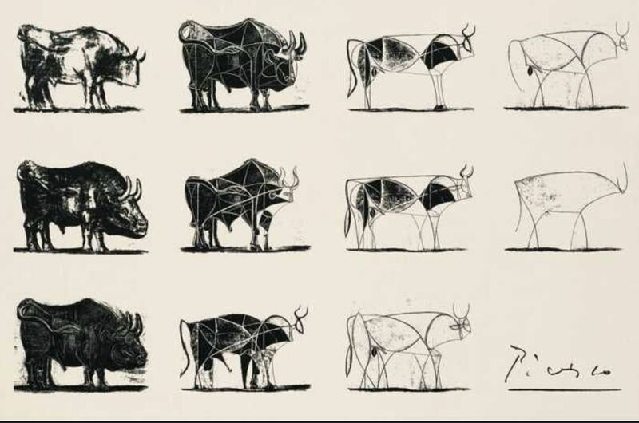

“It takes a lot of hard work to make something simple.” Amazon CTO Dr. [Werner Vogels](https://www.linkedin.com/in/wernervogels/)’ insights on simplexity—managing complexity while delivering simplicity—reminded me of Picasso’s bull sketches. Picasso didn’t just draw; he refined intricate designs into their purest form, proving simplicity isn’t a shortcut—it’s the result of thoughtful effort.

---

Dr. [Werner Vogels](https://www.linkedin.com/in/wernervogels/) shared these key lessons:

1️⃣ Break It Down: Simplify by breaking systems into smaller parts—complex systems thrive when divided into manageable pieces.  
2️⃣ Evolve Smartly: Build adaptable systems—create systems ready to grow and change.  
3️⃣ Automate the Boring: Focus your energy where it matters—automate repetitive tasks and save your creativity for the big stuff.

---

The takeaway? Simplicity takes time, effort, and a whole lot of thought—but it’s worth it. Whether you’re designing cloud architecture or sketching a bull, the goal is the same: refine, simplify, and create something that just works. Simplicity scales faster, sustains better, and becomes truly timeless.

What’s your approach to simplexity?