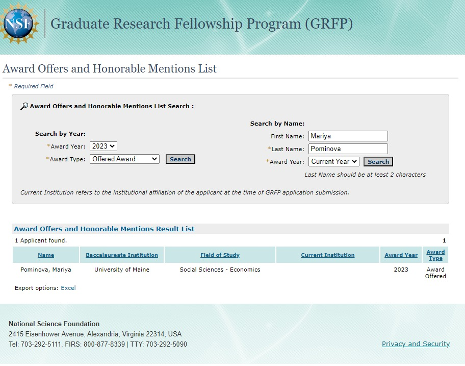
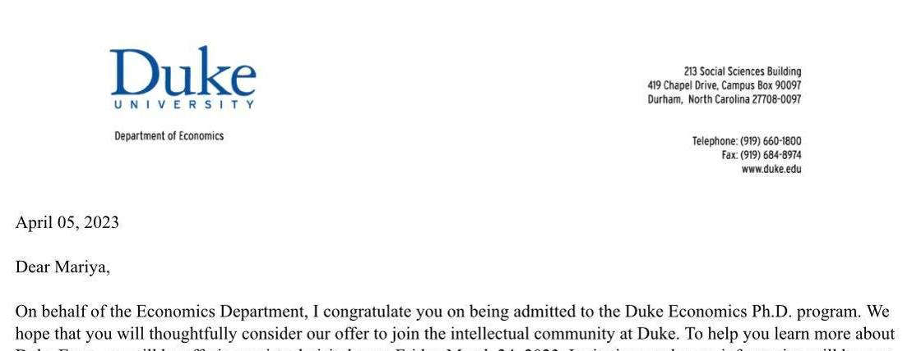

Twenty years ago, Masha and I were studying economics at the kitchen table. Not through textbooks—those came later—but through a hands-on curriculum of pocket money and chore charts. Each completed task earned a meticulously negotiated $1, to be spent strictly on life’s essentials: ice cream, comics, and the occasional glittery sticker.

It was a simple system. Transparent incentives. Immediate feedback. Perfectly designed for a curious seven-year-old and a mom determined to make sure economics felt both real and rewarding.

Fast forward two decades, and that same seven-year-old is now a rising economist—offered an NSF Graduate Research Fellowship and admitted to Duke’s Ph.D. program in economics. The incentives have changed. The stakes are higher. But the instincts are the same.

Back then, I was teaching her how money moves. Now she’s preparing to shape how economies move.

They say early education leaves a mark. I like to think ours came with a budget, a purpose, and a little extra whipped cream.