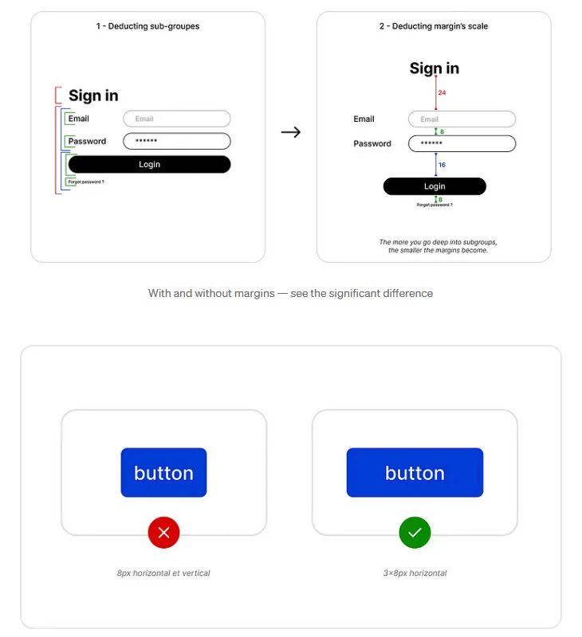

MYTH: Padding is unnecessary white space.

FACT: Padding improves usability.

Some may think:

❌ "More padding = wasted space"

❌ "Users don’t notice padding"

❌ "It’s just a visual thing"

All wrong. Users feel bad padding before they see it. 

Ever scrolled through a site that felt overwhelming?

Ever tapped a tiny button and missed?

Ever struggled to read text packed too tightly?

That’s bad padding. But good padding:

✅ Improves readability

✅ Guides the user’s eye

✅ Creates a sense of order

It’s not decoration—it’s structure.

When a design feels right, users trust it.

Good padding = Good UX.

© [Pavle Lucic](https://www.linkedin.com/in/pavle-lucic/)