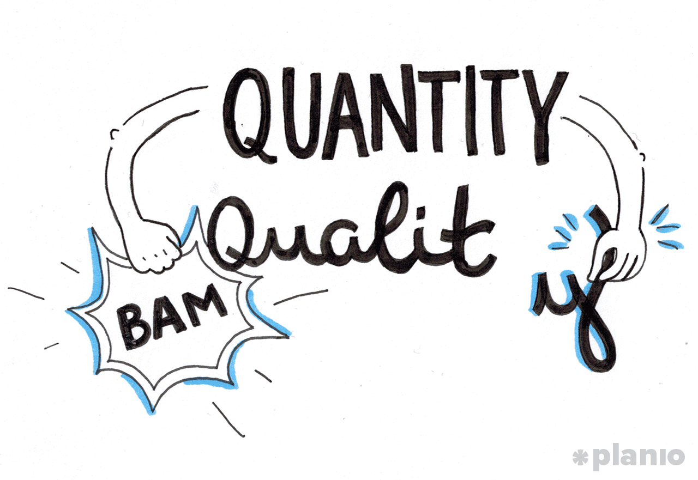

Ever caught yourself staring obsessively at a tiny detail, wondering if the alignment of your buttons could singlehandedly ruin your company's stock price? We've all been there—meticulously planning, endlessly tweaking, convinced perfection is just one more Jira ticket away. But here's a scandalous secret for you: **in tech, your perfectionism might actually be sabotaging your greatness**.

Yeah, seriously.

### The "*Atomic Habits" Photography* Experiment

James Clear’s book, *Atomic Habits*, features a story about a photography professor who split his class into two groups:

* **Team Quantity** was graded strictly by how many photos they snapped.
* **Team Quality** had one job—produce one impeccable, world-shaking photo.

You’d think Team Quality had it easy, right? Just chill, theorize, pontificate, and nail that one shot. Nope. By semester’s end, the finest photos (the truly jaw-dropping ones) came entirely from Team Quantity. Why? Because while the quality crew was still debating the existential meaning of lighting angles, Team Quantity was out there shooting, failing fast, and iterating like caffeinated squirrels.

Moral of the story? Quantity beats quality—at least initially.

## How Karen Cheng (Awkwardly) Danced Her Way to Quality

You might not know the name Karen Cheng, but chances are you've seen this viral video: 

<iframe width="560" height="315" src="https://www.youtube.com/embed/daC2EPUh22w?si=FRr6M5_puSxPMeNE" title="YouTube video player" frameborder="0" allow="accelerometer; autoplay; clipboard-write; encrypted-media; gyroscope; picture-in-picture; web-share" referrerpolicy="strict-origin-when-cross-origin" allowfullscreen></iframe>

Cheng knew she wasn't a great dancer, but she desperately wanted to improve. Did she spend a year theorizing about perfect dance moves? Nope. She adopted the caffeinated squirrel strategy: **quantity over quality**. Every day for a full year, she danced, filmed herself, cringed mightily at the early videos (she even deleted many early attempts), and kept going anyway.

Cheng committed to a fixed time-based challenge—one year—rather than an open-ended quest for perfection. She pushed through a long period of (admittedly embarrassing) quantity before finally achieving astonishing quality.

Her approach? Don't chase perfection. Chase consistency. The quality eventually showed up, slightly late and breathless, but undeniably there.

This lesson extends beautifully into tech.

### Agile Gets It (or: Why Scrum Masters Drink So Much Coffee)

In Agile methodologies like Scrum and Kanban, we embrace frequent delivery—not because we're masochists addicted to standups (though let’s admit it, maybe we are)—but because regular iteration surfaces valuable feedback. Early and often.

This agile "ship-first, ask-questions-later" mentality:

* Reveals user reactions faster (both praise and pitchforks)
* Prevents your team from getting sucked into the black hole of complexity
* Makes continuous learning inevitable (and continuous pizza deliveries probable)

Basically, Agile understands that you won't reach greatness by drawing perfection on a whiteboard—you find it by tripping over imperfections out in the real world.

### The Big Tech Secret Sauce: Breaking Things (Carefully)

Tech giants figured out long ago that "perfect" is the enemy of progress:

* **Facebook** famously said, *"Move fast and break things."* Not exactly a corporate mantra your CFO loves, but it certainly captured the spirit of innovation.
* **Amazon** deploys thousands of code changes a day—small, reversible, and brilliantly reckless. Why? Because the fastest path to "good" often involves cheerfully trying "not-so-good" first.

These organizations don’t sit around crafting hypothetical perfection; they ship relentlessly, measure results, and refine. For them, quantity isn't just a strategy—it’s practically a religion.

### Rethinking "Quality": It’s a Moving Target

Quality isn't born fully-formed from meticulous meetings or whiteboard sketches. It emerges—messy and slightly annoyed—from real-world use. It's forged in user feedback, error messages, and frantic patches at 2 AM.

Instead of pondering endlessly, **get something—anything—into users' hands**. Because the truth is, your users are the ultimate QA testers, even if they don’t know it yet (sorry, users).

So instead of asking, *"Is this perfect yet?"* try asking:

> **"What slightly imperfect thing can we ship today that’ll teach us how to get closer to perfect tomorrow?"**

### Ship More, Stress Less

The uncomfortable truth? In software (and life?), action usually beats speculation. Agile teams don't just understand this—they live by it. They release frequently, fail enthusiastically, and improve relentlessly.

So stop polishing that perfect theoretical feature. Build more. Ship more. Laugh at your failures, learn from them, and iterate fast. Because ironically, it’s through a whole lot of imperfect quantity that you finally achieve genuine, sustainable, user-delighting quality.

And honestly, isn’t that way more fun?

- - -

### TL;DR (Too Long, Didn't Ship):

Stop perfecting. Start releasing. Embrace chaos. Quantity leads to quality—it's science, after all. Just ask Team Quantity, those caffeinated squirrels, and every successful Agile company out there.