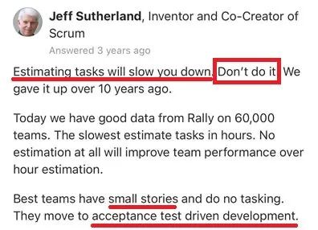

> *“Estimating tasks will slow you down. Don’t do it.”*
>
> — Jeff Sutherland, Co-Creator of Scrum

If you've ever argued for 20 minutes over whether something is a 3-point or a 5-point story, only to rework it mid-sprint anyway—congrats, you've experienced the full inefficiency of Agile estimation rituals.

For years, we’ve convinced ourselves that assigning numbers to work somehow makes it more manageable. But what if the real solution isn’t better estimation, but **less of it**?

- - -

### A Quick Clarification

Yes, Jeff Sutherland’s quote refers to **task estimation**, not story points specifically. Fair enough. But the principle holds.

And even **Ron Jeffries**, one of the original XP authors and possible inventor of story points, has since recanted:

> *“I may have invented story points. If I did, I’m sorry now.”*
>
> *\- [Story Points Revisited by Ron Jeffries](https://ronjeffries.com/articles/019-01ff/story-points/Index.html)*

The message is clear: *we’re not supposed to be sizing work for the sake of predictability—we’re supposed to be delivering value.*

- - -

### Why Estimating Breaks Down

Software development isn’t factory work. Most of it falls into the realm of creative, knowledge-based problem solving. As such, estimates fall apart for a few predictable reasons:

* **Parkinson’s Law**: If you estimate five days, it will take five days—at least.
* **Optimism Bias**: Developers are generally optimistic (or at least hopeful) creatures.
* **Uncertainty**: The more unknowns packed into a story, the less your estimate means.
* **Inaccuracy**: Humans are simply not good at estimating anything bigger than about 2 days of work.

So when someone says, “this story will take two weeks,” it usually translates to, “somewhere between 8 days and 8 weeks.” Which, as far as planning goes, isn’t particularly useful.

- - -

### A Better Strategy: Make Work Smaller

Instead of wrestling complexity into 13-point packages, **break it down** until it fits comfortably into one to two days of effort. That’s not just a productivity trick—it’s an uncertainty-reduction strategy.

Smaller work:

* Is easier to reason about
* Surfaces edge cases earlier
* Delivers faster feedback
* Reduces waste when priorities shift mid-sprint (as they inevitably do)

If a piece of work is too large to deliver in a couple of days, then the risk isn’t the estimate—it’s the scope.

- - -

### Spotify's Approach: Flow Over Forecasting

At **Spotify**, many squads have moved away from story points altogether. Instead of trying to predict how long something will take, they focus on **how predictably small stories flow through the system**. Using lightweight Kanban-style workflows, teams:

* Break work into small, well-scoped stories
* Track **story count and cycle time**, not point velocity
* Use **cumulative flow diagrams** to monitor delivery trends
* Treat estimation as overhead and focus on slicing scope instead

With cross-functional squads empowered to choose their own methods, Spotify teams found that **shrinking work and visualizing flow** created better outcomes than trying to assign numbers to uncertainty.

As a result, many teams deliver more predictably—**without spending hours estimating**, debating Fibonacci numbers, or worrying about whether a story is a 3 or a 5.

**What Spotify Teaches Us**

Spotify’s approach reinforces several powerful Agile principles in practice. By balancing autonomy with alignment, squads are empowered to decide whether or not to estimate, based on what works best for their workflow. Rather than obsessing over forecasting, teams focus on flow—using cycle time and throughput as more practical and meaningful indicators of progress than story point velocity. Small, consistently sized stories improve predictability and reduce the need for sizing debates altogether. Most importantly, stakeholder trust is earned not through perfectly predicted outcomes, but through transparency, steady iteration, and visible delivery.

- - -

### What to Do Instead of Estimating

No, you don't need to throw away all process and hope for the best. Here’s what modern, pragmatic Agile teams do:

* **Break work into truly small, end-to-end stories**
* **Define value clearly**—stories should deliver something, not just move code around
* **Write short, testable acceptance criteria**
* **Use story count and cycle time**, not story points, to measure flow
* **Treat delays as signals**—not excuses to estimate more accurately

Estimation feels like risk management. But most risk lives in complexity, dependencies, and unclear requirements—not the number we slap on a ticket.

- - -

### How to Write Smaller Stories (Without Losing Your Mind)

Small stories are more than tasks. They're the minimum slice of value that moves something forward. A few practical tips:

* Ask “who benefits?” and “what’s the point?”
* If it’s bigger than two days, break it down by behavior or goal—not role or function
* Add acceptance criteria collaboratively—preferably with the engineer doing the work
* Don’t over-specify; a story is a conversation starter, not a contract

Test-first or ATDD approaches work great here. Writing just enough code to meet a test makes it harder to gold-plate or overengineer.

Once again. Every story should:

* Identify **who** benefits: *As a \[user or role]…*
* Define **what** they need: *I want…*
* Explain **why** it matters: *So that…*
* Include **short, testable acceptance criteria**
* Leave room for real-time collaboration (don’t over-specify)

If you can’t find value in a story, it’s not a story. It’s a task. And Agile doesn’t run on tasks—it runs on value.

- - -

### When Estimation Still Feels Necessary

If leadership insists on forecasts, offer historical data:

* Track **story count per sprint**
* Measure **average cycle time**
* Estimate at the **epic level**, not per story

No one's saying burn your planning board. But if your Agile process feels more like project theater than software delivery, it might be time to simplify.

- - -

### The Bottom Line

Agile was never about guessing better. It was about **delivering faster, learning continuously, and adjusting frequently**.

Shrinking stories helps you do all of those things—without the estimation overhead. And in a world where priorities shift, complexity hides in the details, and feedback is gold, that’s a competitive advantage.

So next time someone asks for an estimate, try this:
**“If it’s too big to deliver in two days, it’s too big to estimate.”**
Then break it down, and build it better.